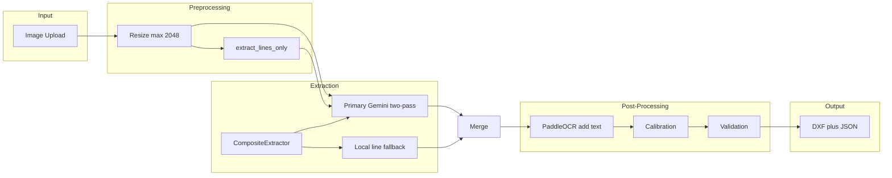

# Sketch-to-DXF Architecture

## Extraction Pipeline

1. **Preprocessing:** Image is resized (max dimension 2048) and optionally converted to a line-only image for wall extraction.
2. **Extraction:** `CompositeExtractor` tries `PrimaryGeminiExtractor` (Gemini two-pass: walls from line image, text from original). On exception or empty entities, it uses `LocalLineExtractor` (OpenCV Hough lines).
3. **Post-processing:** PaddleOCR can add text/dimensions; calibration infers scale; validation applies OCR corrections and dimension checks.
4. **Output:** DXF and JSON geometry.

## Extractor Abstraction

All geometry extractors implement the same interface:

- **`GeometryExtractor.extract(original_image, preprocessed_image=None) -> SketchGeometry`**

Implementations:

- **PrimaryGeminiExtractor:** Gemini two-pass (walls + text). Uses configurable timeout and retries with exponential backoff; on repeated failure, tries a faster fallback model once. When both passes return no geometry, internal local line fallback runs.
- **LocalLineExtractor:** OpenCV Hough line detection on the line-only image. No API calls; returns LINE entities only.
- **CompositeExtractor:** Tries primary first; on exception or empty entities, runs local fallback.

This makes it straightforward to add more backends (e.g. another cloud API or a local DL model) and test each path in isolation.

## Key Configuration

- **Gemini timeout:** `GEMINI_REQUEST_TIMEOUT_SEC` (default 120). The SDK default is 60s; vision + structured output often needs more, or you may see "Server disconnected without sending a response."
- **Fallback model:** `GEMINI_FALLBACK_MODEL` (e.g. `gemini-2.0-flash`) is tried once when the primary model times out after retries.
- **Validation:** When extraction fails (no entities), ratio validation is skipped and confidence is not penalized, so the UI does not double-penalize for "extraction failed + validation failed."

## Optional Deep Learning

Future or advanced options (not required for the core app):

- **Line detection networks:** e.g. [LCNN](https://github.com/zhou13/lcnn), [HAWP](https://github.com/cherubicxn/hawp) for higher-quality line segments.
- **Segment Anything:** for regions that could be mapped to polylines.
- **Other vision APIs:** OpenAI GPT-4V or Anthropic Claude as alternative cloud extractors behind the same `GeometryExtractor` interface.

Keep any heavy or optional DL behind an extra dependency group or env flag so the core app runs with only Gemini + OpenCV + PaddleOCR.
